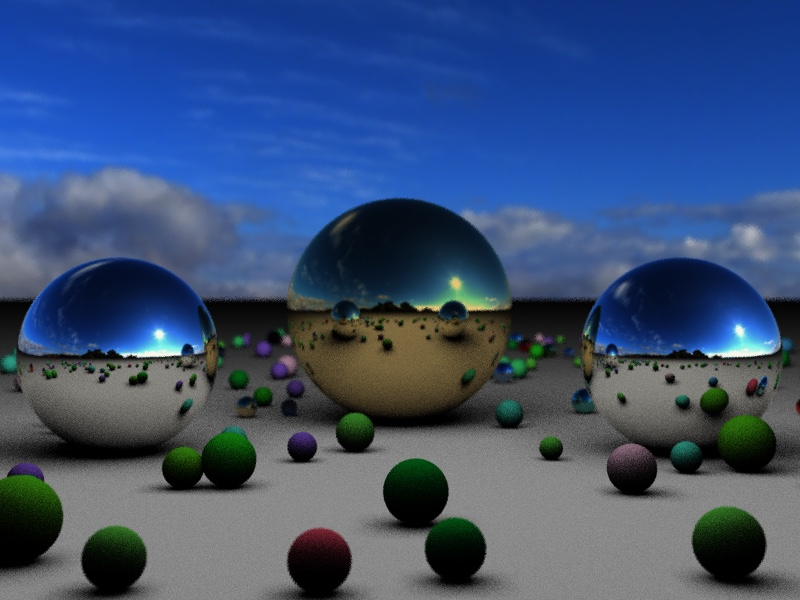

# Perspectiva

Perspectiva is a (relatively) simple C++ raytracing program. It's a hobby project, and so obviously not recommended for anything remotely serious.

Some modest features:

* Scene files that use a YAML-based text format

* Environment maps (using skybox or equiangular spherical-projection images)
    
* Pixel subsampling (uniform or jittered uniform)

* Area lights (and corresponding soft shadows)

* Fresnel reflection and refraction
    
* Semi-realistic depth-of-field, including bokeh from polygonal apertures

* Outputs JPEG, PNG, or [OpenEXR](https://en.wikipedia.org/wiki/OpenEXR) images

## Building Perspectiva

Perspectiva can be built with a modern C++ compiler, such as GCC's g++ or Clang's clang++. Since it uses some features from C++-17, it's best to use version 7 or later of GCC or version 5 or later of Clang.

It requires the following libraries:

* [yaml-cpp](https://github.com/jbeder/yaml-cpp)

* IlmImf, part of [OpenEXR](https://github.com/AcademySoftwareFoundation/openexr)

The name is taken from the titles of various medieval works on optics, such as those by Roger Bacon, Witelo, and John Pecham.
